快速入门
========

**QuecOS CSDK** 软件开发包旨在帮助用户快速构建业务应用程序。本文档指导用户搭建 **718PM** 硬件开发的软件环境，通过一个简单示例展示如何使用 **QuecOS CSDK** 配置菜单、编译并下载固件到对应模组型号的开发板。

准备工作
--------

硬件要求
********

- 任意一款 **EC800ZCN_LC**、**EC800ZCN_LD**、**EG800ZCN_LA**、**EC800ZCN_LF**、**EG800ZEU_LA** 或 **EG800ZLA_LA** 型号的 TE-A 模组
- Windows 系统计算机
- 移远提供的官方 **EVB** 底板
- USB 数据线（A 转 Micro-B）

软件要求
********

- **quecos-toolchain.exe**：编译工具链安装程序，包含 **CMake**、**Ninja** 和 **Python** 编译构建工具，用于生成对应型号的应用程序
- **QFLASH.exe**：模组固件烧录程序，用于烧录 **QuecOS CSDK** 编译生成的固件
- **Quectel** 提供的模组驱动程序，用于 PC 识别模组的 USB 枚举口
- **EPAT**：移芯官方提供的日志捕获工具，用于查看模组运行日志以分析应用程序执行情况
- **QCOM**：移远提供的 COM 口工具程序，用于执行和验证 AT 命令

安装步骤
--------

1. 通过移远技术支持获取 **quecos-toolchain-x.x.x.exe** 编译环境安装程序。
2. 双击执行安装程序，提示申请管理员权限时，点击“同意”。

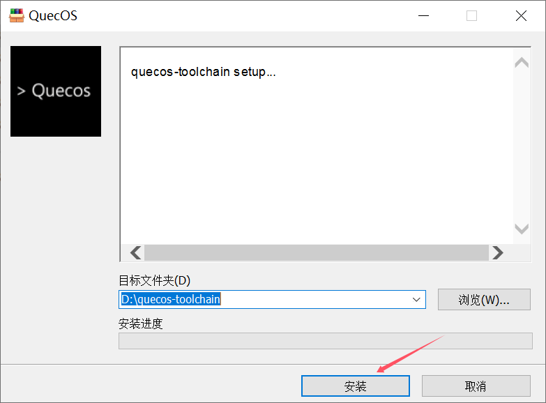

3. 根据提示选择解压目录，默认为 **D:\quecos-toolchain**，可根据需要自定义。解压后文件约占 **4.3GB** 空间，请确保磁盘空间充足。

4. 解压完成后，命令行窗口将自动弹出并执行编译环境的解压安装。

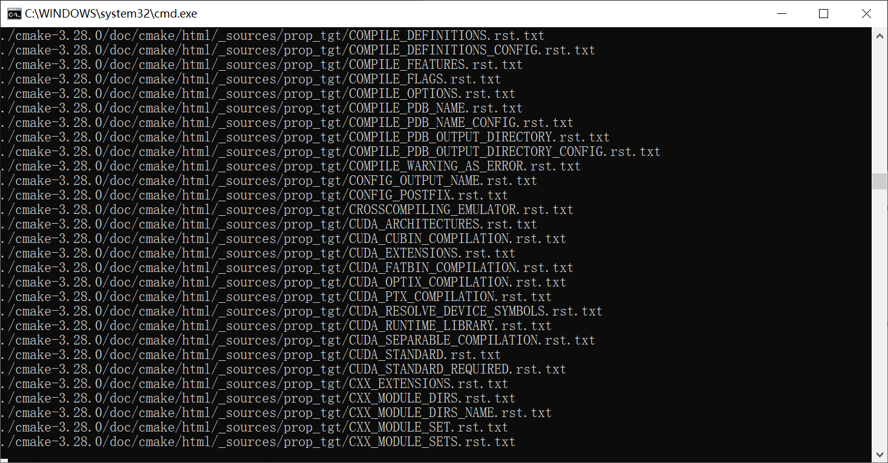

5. 解压完成后，目录结构如下，包含 **CMake**、**Ninja**、**Python3.8** 和 **GCC** 编译工具。

.. figure:: ../images/quecos-toolchain-installation-complete.png
    :align: center
    :alt: 完成 quecos-toolchain 后的对应目录情况
    :figclass: align-center

6. 将 **quecos-toolchain** 工具链添加到系统环境变量 **Path** 中。例如，默认安装路径为 **D:\quecos-toolchain** 时，添加 **D:\quecos-toolchain\bin**。

7. 进入 Windows 系统设置界面（以 Windows 10 为例），配置 **Path** 环境变量：

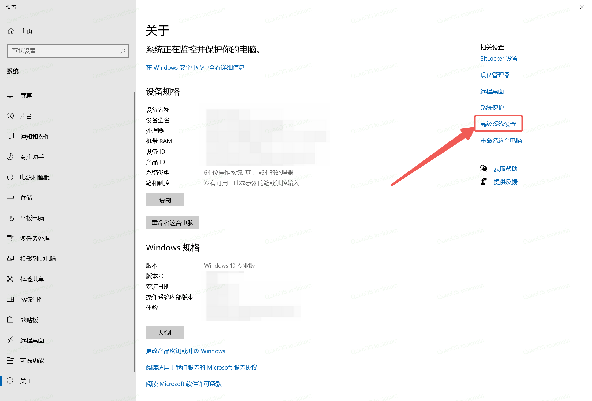

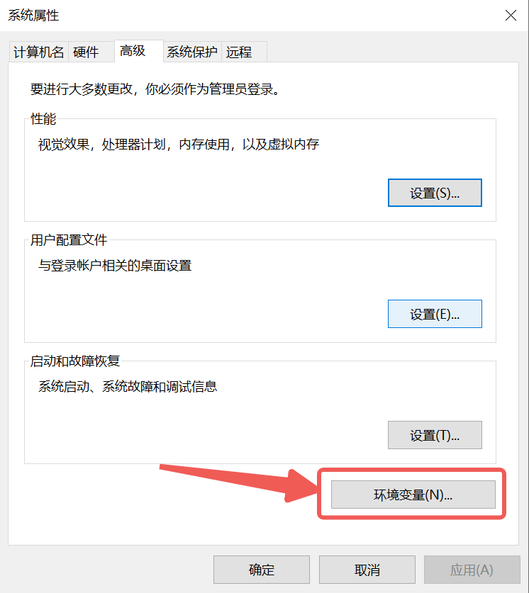

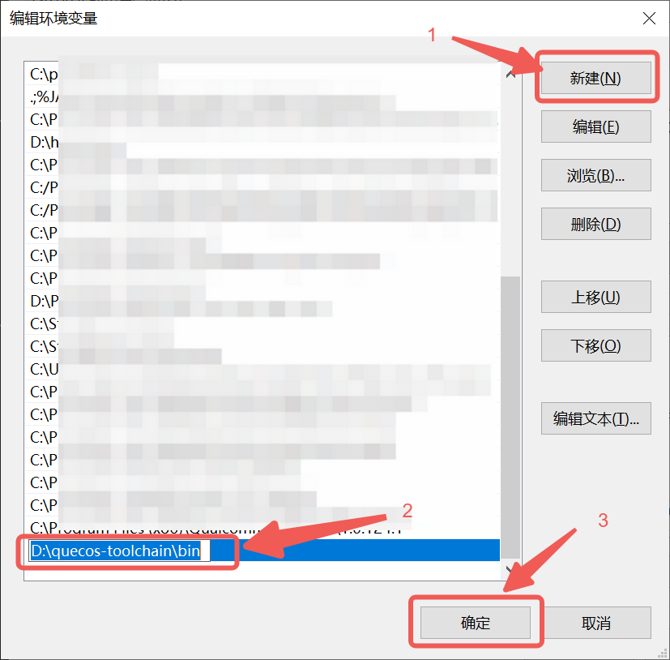

8. 新建命令行窗口，输入 ``quecos.exe --version`` 检查版本信息。若成功显示版本信息，则表示编译环境安装完成。

.. figure:: ../images/quecos-toolchain-check-version.png
    :align: center
    :alt: 在新命令行中，输入quecos.exe --version获取执行信息
    :figclass: align-center

编译第一个工程
--------------

完成编译环境和相关软件安装后，打开 **Quectel** 提供的 **QuecOS CSDK** 文件夹。以下为 **CSDK** 根目录结构：

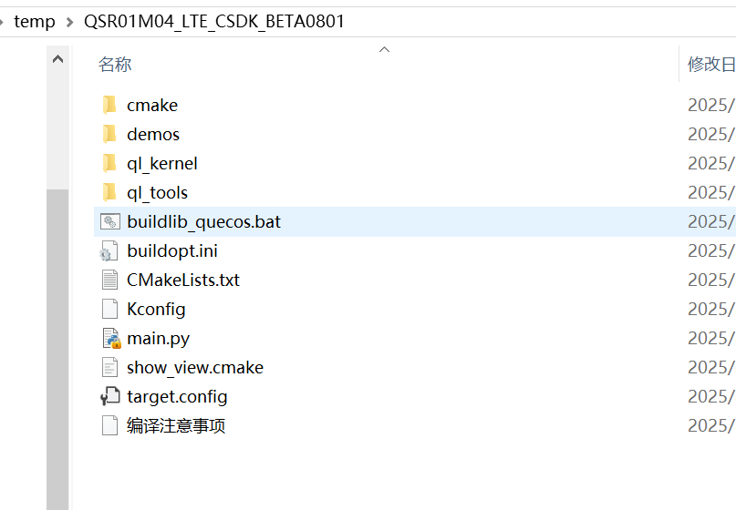

1. 目录结构说明：

.. code-block:: text

    目录树：
    ├── **CMakeLists.txt**         // QuecOS 编译的主 CMake 工程文件
    ├── **Kconfig**                // 管理宏控依赖及约束条件
    ├── **buildlib_quecos.bat**    // Windows 环境一键编译配置脚本
    ├── **buildopt.ini**           // 控制编译模组型号信息
    ├── **cmake**                  // CMake 相关配置文件
    ├── **demos**                  // 存放所有 demo 程序
    ├── **main.py**                // 主 Python 脚本
    ├── **ql_kernel**              // 平台侧 kernel 相关头文件及库
    ├── **ql_tools**               // 编译及调试工具
    ├── **show_view.cmake**        // 在命令行显示宏控信息
    ├── **target.config**          // CSDK 可裁剪宏控选项配置文件
    └── 编译注意事项

2. 修改 **buildopt.ini** 文件，例如编译生成 **EC800ZCN_LD** 型号固件。此文件用于为 **buildlib_quecos.bat** 提供编译参数：

.. code-block:: ini

    [buildopt]
    build_operation=new
    build_project=EC800ZCN_LD
    build_version=EC800ZCNLDR01A01M04_BETA0721
    build_subver=V01
    build_qinf=FFF
    build_certver=EC800ZCNLDR01A01M04_BETA0721
    build_svn=01
    build_modemapp=01.001
    build_oem=
    [end]

3. 新建命令行窗口，切换到 **CSDK** 工程目录，执行 **.\buildlib_quecos.bat** 脚本：

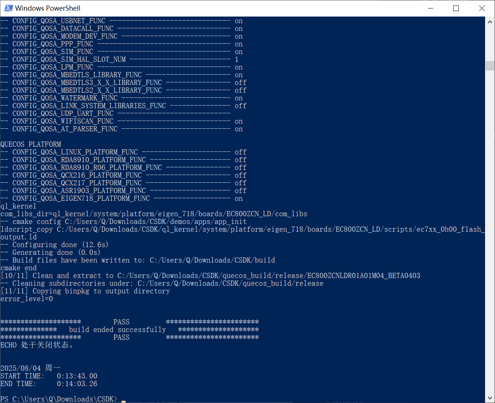

4. 编译生成物位于 **quecos_build\release** 目录下。

5. 固件烧录参考《**QFlash 用户指导**》中 **EC800Z** 的烧录方法。

新增第一个 Demo
---------------

1. 在 **demos/apps** 目录下新建 **hello_world** 文件夹，并创建 **hello_world.c** 和 **CMakeLists.txt** 文件：

.. code-block:: text

    目录树：
    ├── **CMakeLists.txt**
    └── **hello_world.c**

2. 在 **hello_world.c** 文件中添加以下代码：

.. code-block:: c

    // QOSA 系统核心定义头文件
    #include "qosa_def.h"
    // 包含 QOSA 系统 API 头文件
    #include "qosa_sys.h"
    // 包含 QOSA 日志系统头文件
    #include "qosa_log.h"

    // 定义错误级别日志宏
    #define log_e(...) QOSA_LOG_E(LOG_TAG, ##__VA_ARGS__)
    // 定义警告级别日志宏
    #define log_w(...) QOSA_LOG_W(LOG_TAG, ##__VA_ARGS__)
    // 定义信息级别日志宏
    #define log_i(...) QOSA_LOG_I(LOG_TAG, ##__VA_ARGS__)
    // 定义调试级别日志宏
    #define log_d(...) QOSA_LOG_D(LOG_TAG, ##__VA_ARGS__)
    // 定义详细级别日志宏
    #define log_v(...) QOSA_LOG_V(LOG_TAG, ##__VA_ARGS__)

    // 定义 hello world 任务的栈大小为 1024 字节
    #define QUECOS_HELLO_WORLD_DEMO_TASK_STACK_SIZE 1024
    // 定义 hello world 任务优先级为正常优先级
    #define QUECOS_HELLO_WORLD_DEMO_TASK_PRIO QOSA_PRIORITY_NORMAL

    // 声明全局任务句柄，初始化为空
    static qosa_task_t g_quec_hello_world_demo_task = QOSA_NULL;

    // 定义 hello world 任务的主处理函数
    static void quec_hello_world_demo_process(void *ctx)
    {
        // 初始化计数器
        int hello_world_cnt = 0;

        // 无限循环
        while (1)
        {
            // 打印详细日志，显示当前计数值
            log_v("hello world count=%d", hello_world_cnt++);
            // 任务休眠 1000 毫秒（1 秒）
            qosa_task_sleep_ms(1000);
        }
    }

    // 初始化 hello world demo 的函数
    void quec_hello_word_init(void)
    {
        // 打印详细日志，表示进入 hello world demo
        log_v("enter hello world DEMO !!!");
        // 检查任务是否尚未创建
        if (g_quec_hello_world_demo_task == QOSA_NULL)
        {
            // 创建 hello world 任务
            qosa_task_create(
                &g_quec_hello_world_demo_task,           // 任务句柄指针
                QUECOS_HELLO_WORLD_DEMO_TASK_STACK_SIZE, // 任务栈大小
                QUECOS_HELLO_WORLD_DEMO_TASK_PRIO,       // 任务优先级
                "hello_world_demo",                      // 任务名称
                quec_hello_world_demo_process,           // 任务处理函数
                QOSA_NULL);                              // 任务参数
        }
    }

3. 在 **CMakeLists.txt** 文件中添加以下代码：

.. code-block:: cmake

    # 打印当前源码目录配置信息
    message(STATUS "cmake config ${CMAKE_CURRENT_SOURCE_DIR}")

    # 设置目标名称
    set(target hello_world)

    # 添加目标文件到应用程序库列表
    add_apps_libraries($<TARGET_FILE:${target}>)

    # 添加静态库目标
    add_library(${target} STATIC)

    # 设置目标的归档输出目录
    set_target_properties(${target} PROPERTIES ARCHIVE_OUTPUT_DIRECTORY ${out_quec_lib_dir})

    # 添加私有包含目录
    target_include_directories(${target} PRIVATE
        ${SOURCE_TOP_DIR}
        ${SOURCE_SYS_DEBUG_DIR}
        ${SOURCE_SYS_OS_DIR}
        ${SOURCE_COMPONENTS_PUBLIC_INC})

    # 添加公共包含目录
    target_include_directories(${target} PUBLIC ${CMAKE_CURRENT_SOURCE_DIR})

    # 添加源文件
    target_sources(${target} PRIVATE
        hello_world.c
    )

    # 条件链接 system_os 库
    target_link_libraries_if(CONFIG_QOSA_LINK_SYSTEM_LIBRARIES_FUNC THEN ${target} system_os)

4. 若不涉及功能裁剪，可跳过步骤 5-10。添加宏控需符合 **Kconfig** 语法及 **CMake** 规则。

5. 修改 **demos/apps/Kconfig** 文件，添加：

.. code-block:: kconfig

    config QAPP_HELLO_WORLD_DEMO_FUNC
        bool "Enable hello world demo"
        default n

6. 修改 **demos/apps/CMakeLists.txt** 文件，添加：

.. code-block:: cmake

    if(CONFIG_QAPP_HELLO_WORLD_DEMO_FUNC)
        add_subdirectory_if_exist(hello_world)
    endif()

7. 修改 **demos/apps/include/quecos_apps_config.h.in** 文件，添加：

.. code-block:: c

    /**
     * Hello world demo config define
     */
    #cmakedefine CONFIG_QAPP_HELLO_WORLD_DEMO_FUNC

8. 修改 **demos/apps/app_init/app_init.c** 文件，添加：

.. code-block:: c

    #ifdef CONFIG_QAPP_HELLO_WORLD_DEMO_FUNC
    extern void quec_hello_word_init(void);
    #endif /* CONFIG_QAPP_HELLO_WORLD_DEMO_FUNC */

    void app_init(void)
    {
        #ifdef CONFIG_QAPP_HELLO_WORLD_DEMO_FUNC
        quec_hello_word_init();
        #endif /* CONFIG_QAPP_HELLO_WORLD_DEMO_FUNC */
    }

9. 修改根目录下 **target.config** 文件，添加：

.. code-block:: text

    CONFIG_QAPP_HELLO_WORLD_DEMO_FUNC=y

10. 修改根目录下 **show_view.cmake** 文件，添加：

.. code-block:: cmake

    # Customer apps
    message("\nCustomer Apps")
    message(STATUS "CONFIG_QAPP_HELLO_WORLD_DEMO_FUNC ------------------------- ${CONFIG_QAPP_HELLO_WORLD_DEMO_FUNC}")

11. 执行 **.\buildlib_quecos.bat** 编译工程，检查日志确认宏控 **CONFIG_QAPP_HELLO_WORLD_DEMO_FUNC** 已启用：

.. code-block:: text

    Customer Apps
    -- CONFIG_QAPP_HELLO_WORLD_DEMO_FUNC ------------------------- on
    ql_kernel
    com_libs_dir=ql_kernel/system/platform/eigen_718/boards/EC800ZCN_LD/com_libs
    -- cmake config E:/temp/QSR02_E_LTE_CSDK_BETA/demos/apps/app_init
    -- cmake config E:/temp/QSR02_E_LTE_CSDK_BETA/demos/apps/hello_world
    ldscript_copy E:/temp/QSR02_E_LTE_CSDK_BETA/ql_kernel/system/platform/eigen_718/boards/EC800ZCN_LD/scripts/ec7xx_0h00_flash_output.ld
    -- Configuring done (7.1s)
    -- Generating done (0.0s)
    -- Build files have been written to: E:/temp/QSR02_E_LTE_CSDK_BETA/build
    cmake end
    [12/13] Clean and extract to E:/temp/QSR02_E_LTE_CSDK_BETA/quecos_build/release/EC800ZCNLDR01A01M04_BETA0403
    -- Cleaning subdirectories under: E:/temp/QSR02_E_LTE_CSDK_BETA/quecos_build/release
    -- Found build_version folder (E:/temp/QSR02_E_LTE_CSDK_BETA/quecos_build/release/EC800ZCNLDR01A01M04_BETA0403); cleaning its content.
    -- delete E:/temp/QSR02_E_LTE_CSDK_BETA/quecos_build/release/EC800ZCNLDR01A01M04_BETA0403/DBG success
    -- delete E:/temp/QSR02_E_LTE_CSDK_BETA/quecos_build/release/EC800ZCNLDR01A01M04_BETA0403/MergeRfTable.bin success
    -- delete E:/temp/QSR02_E_LTE_CSDK_BETA/quecos_build/release/EC800ZCNLDR01A01M04_BETA0403/Quectel_Disclaimer_for_Software_BETA_Version.pdf success
    -- delete E:/temp/QSR02_E_LTE_CSDK_BETA/quecos_build/release/EC800ZCNLDR01A01M04_BETA0403/agentboot_uart success
    -- delete E:/temp/QSR02_E_LTE_CSDK_BETA/quecos_build/release/EC800ZCNLDR01A01M04_BETA0403/agentboot_usb success
    -- delete E:/temp/QSR02_E_LTE_CSDK_BETA/quecos_build/release/EC800ZCNLDR01A01M04_BETA0403/at_command.hbinpkg success
    -- delete E:/temp/QSR02_E_LTE_CSDK_BETA/quecos_build/release/EC800ZCNLDR01A01M04_BETA0403/quec_download_config.ini success
    -- delete E:/temp/QSR02_E_LTE_CSDK_BETA/quecos_build/release/EC800ZCNLDR01A01M04_BETA0403/quec_download_uart.ini success
    -- delete E:/temp/QSR02_E_LTE_CSDK_BETA/quecos_build/release/EC800ZCNLDR01A01M04_BETA0403/quec_download_uart_linux.ini success
    -- delete E:/temp/QSR02_E_LTE_CSDK_BETA/quecos_build/release/EC800ZCNLDR01A01M04_BETA0403/quec_download_usb.ini success
    -- delete E:/temp/QSR02_E_LTE_CSDK_BETA/quecos_build/release/EC800ZCNLDR01A01M04_BETA0403/quec_download_usb_linux.ini success
    [13/13] Copying binpkg to output directory
    error_level=0

    ********************        PASS         ***********************
    **************   build ended successfully   ********************
    ********************        PASS         ***********************
    ECHO 处于关闭状态。

    2025/08/04 周一
    START TIME:  13:46:29.96
    END TIME:    13:46:40.28

    PS E:\temp\QSR02_E_LTE_CSDK_BETA>

固件烧录
--------

1. 打开 **QFLASH** 程序，点击“Load FW Files”：

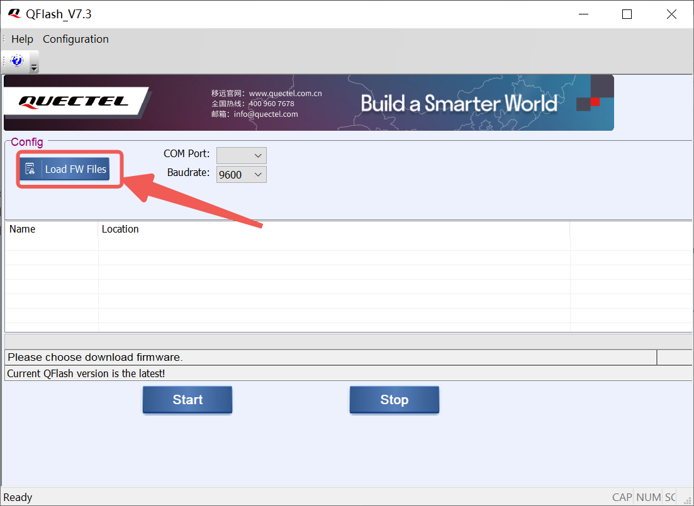

2. 选择 **quecos_build\release** 文件夹中自定义版本的 **.hbinpkg** 文件：

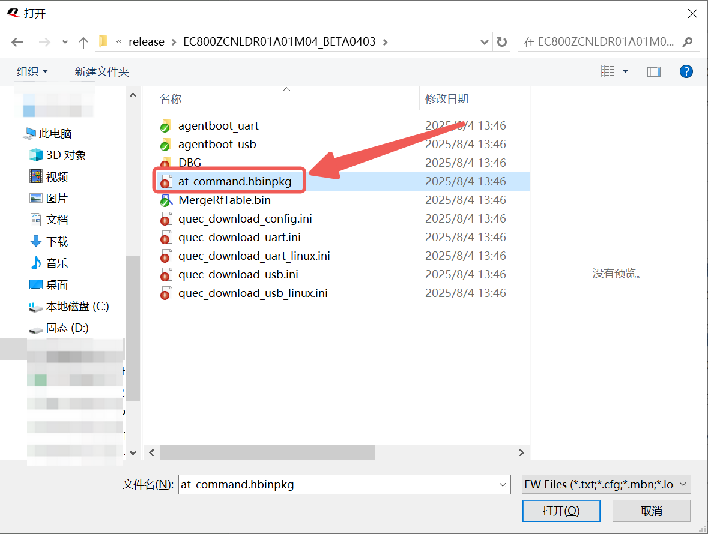

3. 在 **EVB** 底板上安装对应型号的 **TE-A** 模组，短接 **boot** 引脚进入下载模式：

.. figure:: ../images/eigen-qflash-evb-pwr-up.png
    :align: center
    :alt: TE-A 开机进入下载模式
    :figclass: align-center

4. 打开设备管理器，查看“端口 (COM 和 LPT)”中的 **Quectel QDLoader Port**，记录 COM 通道号：

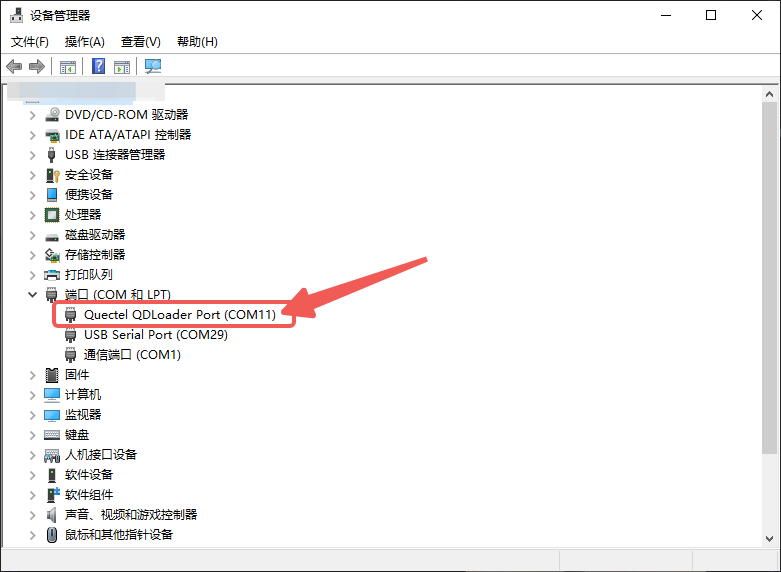

5. 在 **QFLASH** 中选择对应 COM 通道，点击“Start”开始下载，等待进度条完成并显示“PASS”：

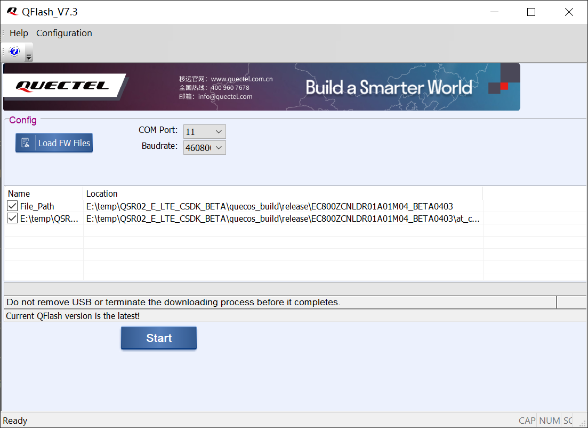

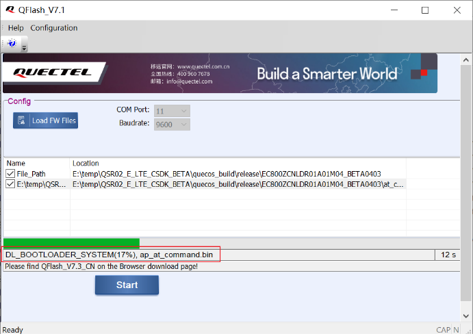

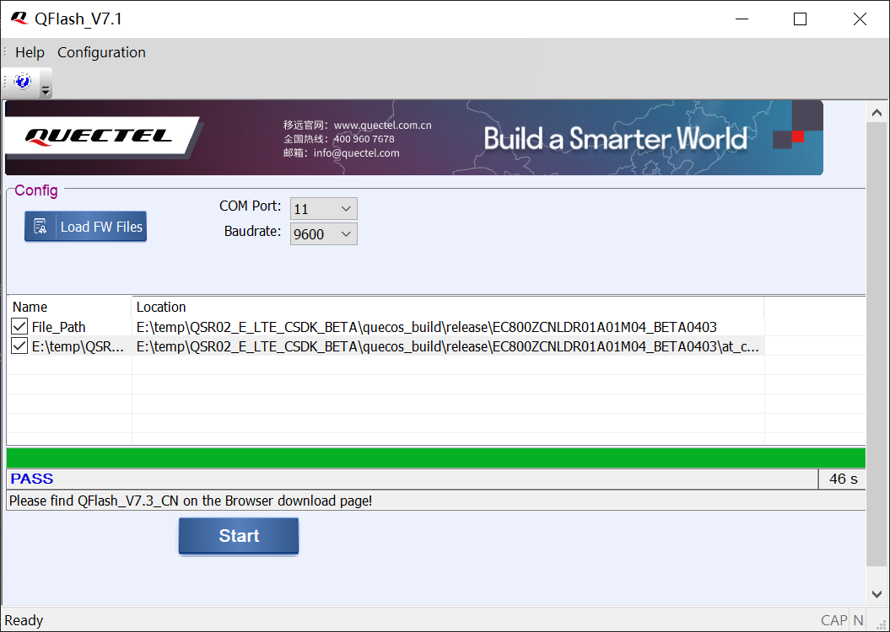

使用移芯日志工具
----------------

通过 **EPAT** 日志工具验证 **hello world** 程序是否在模组上运行。驱动及 **EPAT** 软件需向 FAE 索取。

1. 打开 **EPAT.exe**，选择“Serial Device”并点击“OK”：

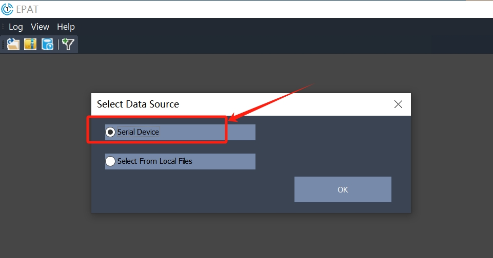

2. 点击“Device Communication”，选择串口设备并点击“打开”：

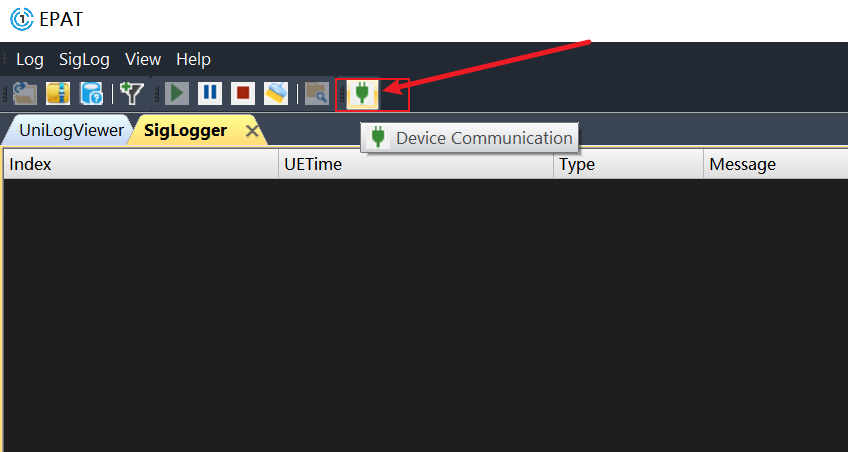

3. 选择设备管理器中的 **Quectel USB DIAG Port** COM 通道，点击“OK”查看日志输出：

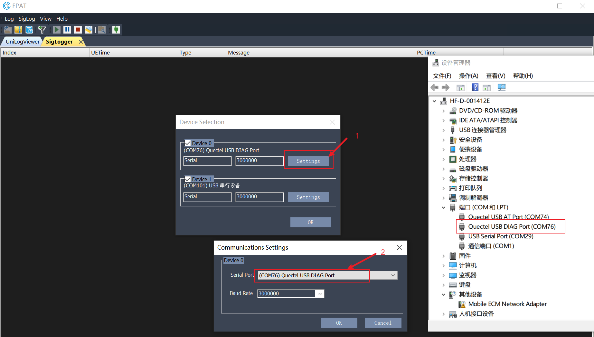

4. 点击“Database State”，选择数据库文件，匹配日志数据库：

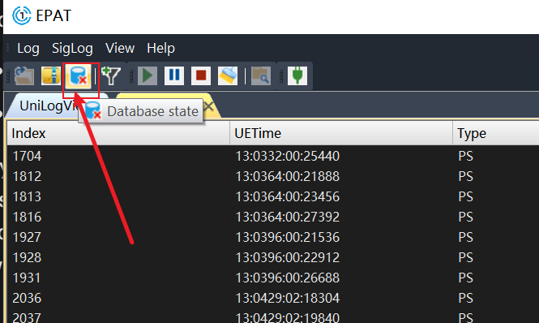

5. 选择 **quecos_build\release** 自定义版本文件夹下的 **DBG/comdb.txt** 文件，点击“Update”：

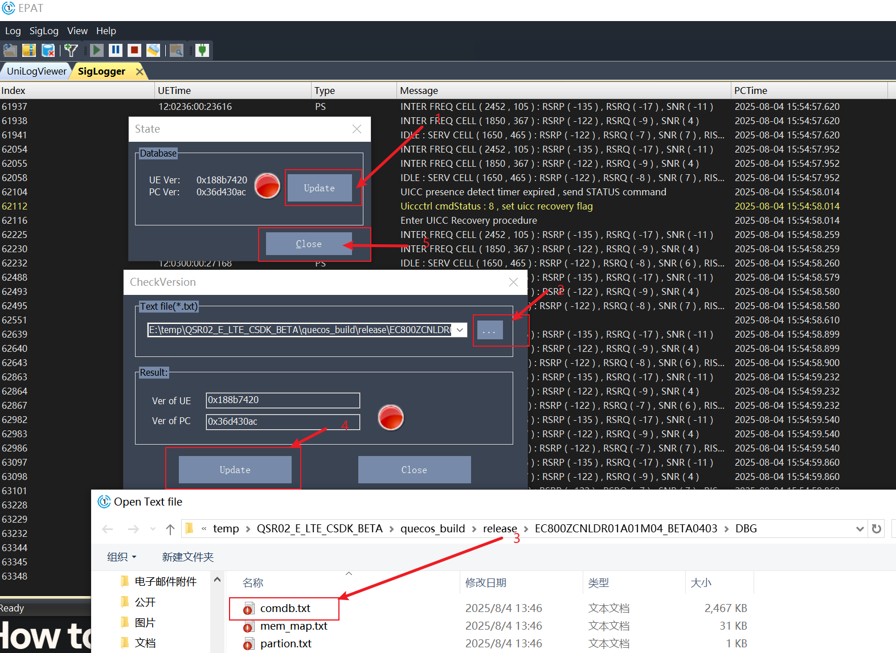

6. 在“UniLogViewer”选项卡，点击“Stop”停止日志记录：

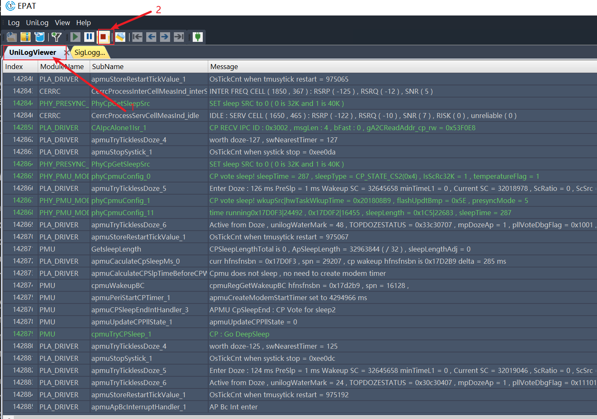

7. 使用“Ctrl+F”搜索“hello”，点击“Find Previous”查看 **hello world** 程序日志：

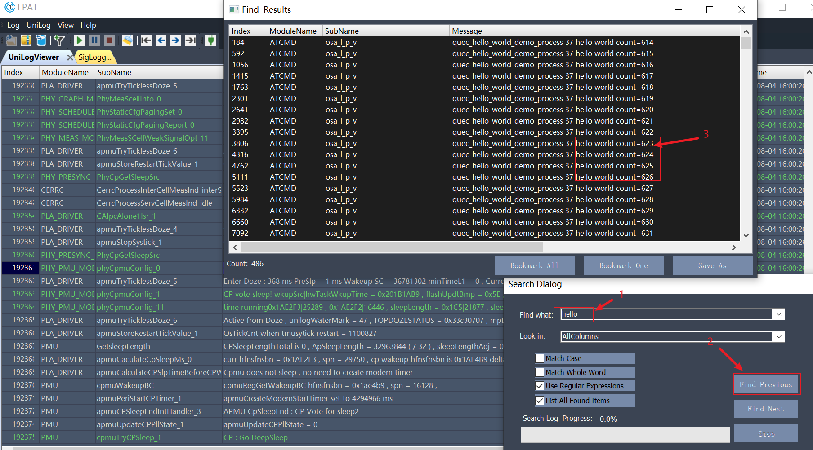

8. 完成上述步骤后，用户可根据业务需求扩展功能。

卸载编译环境
------------

如需卸载 **QuecOS CSDK** 编译工具链，删除 **D:\quecos-toolchain** 目录，并移除系统环境变量 **Path** 中的相关条目即可。